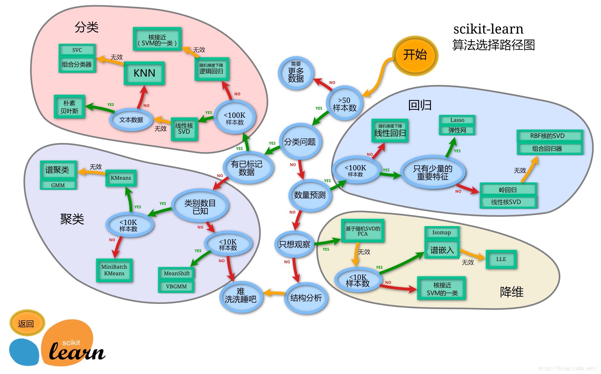
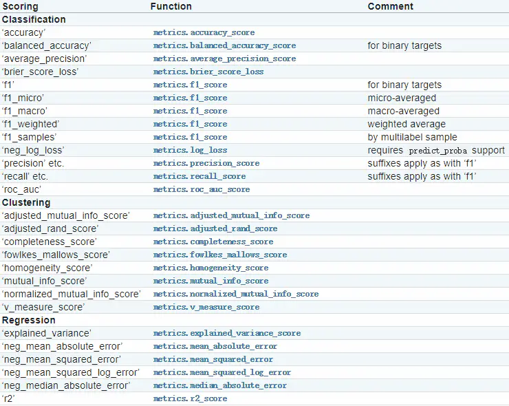

Sklearn介绍

sklearn (scikit-learn) 是基于 Python 语言的**机器学习**工具

1. 是个简单高效的**数据挖掘**和**数据分析**工具
2. 建立在 NumPy ，SciPy 和 matplotlib 上
3. 开源，可**商业使用** - BSD许可证


# 关联规则

```python
import pandas as pd
from mlxtend.frequent_patterns import apriori
from mlxtend.frequent_patterns import association_rules

data = {'i':[1,2,3,4],
        'd':[0,1,0,1],
        'x':[1,1,1,1],
        'u':[0,0,0,1]
}
df = pd.DataFrame(data)
df = df[['i','d','x','u']]
df
	i	d	x	u
0	1	0	1	0
1	2	1	1	0
2	3	0	1	0
3	4	1	1	1

# 支持度(support) ： s(x) = a(x)/N
	#:总的事件中，x出现的程度
frequent_itemsets = apriori(df[['d','x','u']],min_support=0.50,use_colnames=True)
frequent_itemsets
	support	itemsets
0	0.5	    (d)
1	1.0	    (x)
2	0.5	    (d, x)
# 计算规则	
	#:筛选阈值
 rules = association_rules(frequent_itemsets,metric='lift',min_threshold=0.5)
rules
	antecedents	consequents	antecedent support	consequent support	support	confidence	lift	leverage	conviction
0	(d)	(x)	0.5	1.0	0.5	1.0	1.0	0.0	inf
1	(x)	(d)	1.0	0.5	0.5	0.5	1.0	0.0	1.0

# 置信度(confidence) ： p(Y|X) = p(XY) /p(x)
	#：在包含x的事件中，y出现的程度
    
# 提升度(lift) : confidence (A==>B) /support(B) =p(B|A)/p(B)
	#：A对B出现的概率的影响程度，等于一为独立，大于一表明提升程度越大
```


# 数据获取

```python
# 从sklearn中现有的数据集中获取
import pandas as pd
from sklearn.datasets import load_iris
data = load_iris()

# 从csv文件中导入
import pandas as pd
data = pd.read_csv('xxx.csv')
```

# 数据探查

```python
# shape 查看数据的形状维度
data.shape
(150, 4)

# info 简单来看看数据格式或者是非空有多少或者看看列名
x.info()

<class 'pandas.core.frame.DataFrame'>
RangeIndex: 150 entries, 0 to 149
Data columns (total 4 columns):
    Column  Non-Null Count  Dtype  
---  ------  --------------  -----  
 0   0       150 non-null    float64
 1   1       150 non-null    float64
 2   2       150 non-null    float64
 3   3       150 non-null    float64
dtypes: float64(4)
memory usage: 4.8 KB

# describe 简单看看各个百分位 计数 均值 方差 最大最小
x.describe()

		0			1			2			3
count	150.000000	150.000000	150.000000	150.000000
mean	5.843333	3.057333	3.758000	1.199333
std		0.828066	0.435866	1.765298	0.762238
min		4.300000	2.000000	1.000000	0.100000
25%		5.100000	2.800000	1.600000	0.300000
50%		5.800000	3.000000	4.350000	1.300000
75%		6.400000	3.300000	5.100000	1.800000
max		7.900000	4.400000	6.900000	2.500000

# .isnull().sum() 看看空值的数量
x.isnull().sum()

0    0
1    0
2    0
3    0
dtype: int64
    
# .nunique() 看看有多少个不一样的值 如果只有一种那说明这是个无关紧要的特征
x.nunique()

0    35
1    23
2    43
3    22
dtype: int64

# y.value_counts() 看看结果 是不是个均衡的数据集
y.value_counts()

0    50
1    50
2    50
dtype: int64
```

# 数据处理

## 数据去重

```python
data = data.drop_duplicates()
```

## 空值处理

```python
# 大佬说不要用均值填，那就先用0
data = data.fillna(0)

data_train['Age'].fillna(data_train['Age'].mode()[0],inplace=True)


```

## 去除明显无用特征

```python
# 用眼睛看
data = data.drop(['Time','Pass/Fail'],axis=1)

# 看看有没有哪个特征是清一色的
only_one_value = data.columns[data.nunique() == 1]
data = data.drop(only_one_value,axis=1)
```

## 数据集平衡

```python
# 没给很多库 自己手动切吧
data_0 = data_0.sample(n=len(data_1))
```

## 数据标准化处理

```python
# 预处理preprocessing
from sklearn.preprocessing import StandardScaler

scaler = StandardScaler()
x = scaler.fit_transform(x)
```

## 标签编码

```python
# 变为一列的 而不是独热的那种好多列
df = pd.DataFrame({"Job": ["Programmer", "Programmer", "Writer", "Writer"]})
pd.factorize(df["Job"])[0]

# LabelEncoder
from sklearn import preprocessing
 
le = preprocessing.LabelEncoder()
le.fit(["Japan", "china", "Japan", "Korea","china"])
print('标签个数:%s' % le.classes_)
print('标签值标准化:%s' % le.transform(["Japan", "china", "Japan", "Korea","china"]))
print('标准化标签值反转:%s' % le.inverse_transform([0, 2 ,0 ,1 ,2]))

# 标签个数:['Japan' 'Korea' 'china']
# 标签值标准化:[0 2 0 1 2]
# 标准化标签值反转:['Japan' 'china' 'Japan' 'Korea' 'china']
```

## 数据拆分

```python
from sklearn.model_selection import train_test_split
xtrain,ytrain,xtest,ytest = train_test_split(x, y, test_size = 0.3)
```

## 数据填补

```python
from sklearn.impute import KNNImputer

imputer = KNNImputer(n_neighbors=3,)
data = imputer.fit_transform(data)
data = pd.DataFrame(data)
```


# 特征选择

## 卡方chi2

```python
# chi2 卡方 选出最相关的x个 线性回归任务不能用 二分类多分类可以
from sklearn.feature_selection import SelectKBest
from sklearn.feature_selection import chi2

X = SelectKBest(chi2, k=x).fit_transform(X, y)
```

##  RFE

```python

```


# 特征降维

## PCA(主成分分析)

```python
from sklearn.decomposition import PCA

pca = PCA(n_components='mle') # 这是自动选相关特征的mle
pca_data = pca.fit_transform(test)
pca_data = pd.DataFrame(pca_data)
```

## Lasso

```python

```


# 选择模型



## 分类 Classification

### KNN

KNN算法属于最简单的机器学习算法之一，**核心思想是每个样本都可以用它最接近的k个邻近值来代表**，即如果一个样本在特征空间中的k个最相邻的样本中的大多数属于某一个类别，则该样本也属于这个类别，并具有这个类别上样本的特性。所以KNN算法的结果很大程度商取决于K的选择。

#### **优点**

- 适合对稀有事件进行分类
- 特别适用于多分类问题（对象具有多个分类标签，比SVM表现更好）
- KNN是一种在线技术，新数据可以直接加入数据集而不必进行重新训练
- KNN理论简单，容易实现

#### **缺点**

- 当**样本不平衡**（一个类样本容量很大，其他类样本容量很小），该样本的K个邻居中大容量类的样本占多数
- 针对结果无法给出像决策树那样的规则
- KNN每一次分类都会重新进行一次全局运算。计算量较大

```python
from sklearn.neighbors import KNeighborsClassifier
from sklearn.metrics import roc_auc_score

model = KNeighborsClassifier()
model.fit(xtrain,ytrain)
y_pred = model.predict(xtest)
score = roc_auc_score(y_pred,ytest)
score
0.8211764705882353
```

### 朴素贝叶斯

　　**朴素贝叶斯（Naive Bayes Classifier）**的思想基础是这样的：**对于给出的待分类项，求解在此项出现的条件下各个类别出现的概率，哪个最大，就认为此待分类项属于哪个类别**

#### **优点**

- 方法简单，分类准确率高
- 在接受**大数据量训练和查询时速度快**
- 朴素贝叶斯对结果解释容易理解。

#### **缺点**

- 由于使用了样本属性独立性的假设，所以如果样本属性有关联时其效果不好。

```python
from sklearn.naive_bayes import GaussianNB
from sklearn.metrics import roc_auc_score

model = GaussianNB()
model.fit(xtrain,ytrain)
y_pred = model.predict(xtest)
score = roc_auc_score(y_pred,ytest)
print(score)
0.606060606060606
```

### 随机森林

随机森林（RandomForest）：是一个包**含多个决策树的分类器**，并且其**输出的类别**是由个别树输出的类别的**众数**而定。

随机森林几乎能预测任何数据类型的问题，它是一个相对较新的机器学习方法。

#### **优点**

- **适合离散型和连续型的属性数据**
- 对海量数据，**尽量避免了过度拟合**的问题
- 对高纬度数据（文本或语音类型的数据），**不会出现特征选择困难**的问题
- 实现简单，训练速度快，适合进行分布式计算

#### **缺点**

- 随机森林已经被证明在某些**噪音较大**的分类或回归问题上会**过拟**
- 对于有不同取值的属性的数据，取值划分较多的属性会对随机森林产生更大的影响，所以随机森林在这种数据上产出的属性权值是不可信的。

```python
from sklearn.ensemble import RandomForestClassifier
from sklearn.metrics import roc_auc_score

model = RandomForestClassifier()
model.fit(xtrain,ytrain)

y_pred = model.predict(xtest)
score = roc_auc_score(ytest,y_pred)
print(score)
0.6944444444444443

# 推荐测试的参数
param = {
    'n_estimators': range(200,1000,100),
    'max_features': ['auto', 'sqrt'],
    'max_depth': range(10,101,10),
    'min_samples_split': [2,5,10],
    'min_samples_leaf': [1,2,4],
    'bootstrap': [True, False]
}

```

### SVM(支持向量机)

**支持向量机（Support Vector Machine，即SVM）**：**是一种二分类算法**，属于一般化线性分类器，这类分类器的特点是能够同时最小化经验误差与最大化几何边缘区，因此SVM也被称为**最大边缘区分类器**。

　　其**主要思想为找到空间中的一个能够将所有数据样本划开的超平面**，并且使得样本集中所有数据到这个超平面的距离最短

　　它在解决**小样本、非线性及高维模式识别中表现出许多特有的优势**，并能够推广应用到函数拟合等其他机器学习问题中

#### **优点**

- 解决非线性问题。
- 对**小样本、非线性及高维模式**识别中表现出许多特有的优势
- 可以很好的处理高维数据集
- 泛化能力比较强

#### **缺点**

- SVM算法对大规模训练样本难以实施
- 用SVM解决多分类问题存在困难
- 对于核函数的高维映射解释力不强，尤其是径向基函数。
- 对缺失数据敏感

```PYTHON
# LinearSVC 这个..我觉得好用 在极度不均匀的数据集环境下
from sklearn.svm import LinearSVC
from sklearn.metrics import roc_auc_score

model = LinearSVC()
model.fit(xtrain,ytrain)
y_pred = model.predict(xtest)
score = roc_auc_score(y_pred,ytest)
print(score)
0.5954545454545455

# SVC #预测只有一个答案会报错，也是因为数据集不均衡
from sklearn import svm
from sklearn.metrics import roc_auc_score

model = svm.SVC()
model.fit(xtrain,ytrain)
y_pred = model.predict(xtest)
score = roc_auc_score(y_pred,ytest)
print(score)
0.701923076923077

# NuSVC
from sklearn import svm
from sklearn.metrics import roc_auc_score

model = svm.NuSVC()
model.fit(xtrain,ytrain)
y_pred = model.predict(xtest)
score = roc_auc_score(y_pred,ytest)
print(score)
0.70192307692307
```

### 逻辑回归

Logistic Regression 虽然被称为回归，但其实际上是**分类模型**，并常用于**二分类**。Logistic Regression 因其简单、可并行化、可解释强深受工业界喜爱。(深受我的喜爱)

#### **优点**

- 实施简单，非常高效（计算量小、存储占用低），可以在大数据场景中使用。
- 模型清晰，背后的概率推导经得住推敲
- 计算代价不高，易于理解和实现

#### **缺点**

- 本质上是一个线性的分类器，所以处理不好**特征之间相关**的情况
- 容易欠拟合，精度不高
- 特征空间很大时，性能不好

```python
from sklearn.linear_model import LogisticRegression
from sklearn.metrics import roc_auc_score
model = LogisticRegression()
model.fit(xtrain, ytrain)
y_pred = model.predict(xtest)
score = roc_auc_score(y_pred,ytest)
score
0.6909090909090908
```

### 分类树

DecisionTreeClassifier当预测结果为类别时，决策树被称为分类回归树，当预测结果为一个实数时，决策树为回归决策树。

#### **优点**

- 计算复杂度不高，输出结果易于理解，对中间值的缺失不敏感，可以处理不相关特征数据。

#### **缺点**

- 可能会过拟合，数据集要平衡

```python
from sklearn.tree import DecisionTreeClassifier
from sklearn.metrics import roc_auc_score

model = DecisionTreeClassifier()
model.fit(xtrain,ytrain)
y_pred = model.predict(xtest)
score = roc_auc_score(y_pred,ytest)
score
0.5720823798627002
```

### Bagging(装袋算法)

bagging的思路是训练k个独立的基学习器，对于每个基学习器的结果进行结合（加权或者多数投票）来获得一个强学习器。

#### **优点**

- 随着基学习器数量的增加，理论上可以使分类误差降为0。

#### **缺点**

- 我们最好能为不同的学习器设置好不同的**权重**

```python
from sklearn.ensemble import BaggingClassifier
from sklearn.metrics import roc_auc_score

model = BaggingClassifier()
model.fit(xtrain,ytrain)
y_pred = model.predict(xtest)
score = roc_auc_score(y_pred,ytest)
score
0.6949602122015914
```

### AdaBoost

Boosting, 也称为**增强学习或提升法**，是一种重要的**集成学习**技术， 能够将预测精度仅比随机猜度略高的弱学习器增强为预测精度高的强学习器，这在直接构造强学习器非常困难的情况下，为学习算法的设计提供了一种有效的新思路和新方法。

#### **优点**

- 很好的利用了弱分类器进行级联。
- AdaBoost具有很高的精度。
- 可以将不同的分类算法作为弱分类器。
- 相对于bagging算法和Random Forest算法，AdaBoost充分考虑的每个分类器的权重。

#### **缺点**

- AdaBoost迭代次数也就是弱分类器数目不太好设定，可以使用交叉验证来进行确定。
- **数据不平衡**导致分类精度下降。
- 训练比较耗时，每次重新选择当前分类器最好切分点。

```python
from sklearn.ensemble import AdaBoostClassifier
from sklearn.metrics import roc_auc_score

model = AdaBoostClassifier()
model.fit(xtrain,ytrain)
y_pred = model.predict(xtest)
score = roc_auc_score(ytest,y_pred)
score
0.5240274599542335

n_estimators=160,
                           learning_rate=1
```

### XGBoost

XGBoost 是 “Extreme Gradient Boosting”的简称，可译为**极限梯度提升算法**。

#### **优点**

- **正则化项防止过拟合**
- ***\*xgboost不仅使用到了一阶导数，还使用二阶导数，损失更精确，还可以自定义损失\****
- **XGBoost的并行优化**，XGBoost的并行是在特征粒度上的
- 支持列抽样，不仅能降低过拟合，还能减少计算
- 虑了训练数据为稀疏值的情况，可以为**缺失值或者指定的值指定分支的默认方向**，这能大大提升算法的效率

#### **缺点**

- 贪心耗时
- xgBoosting采用level-wise生成决策树，同时分裂同一层的叶子，从而进行多线程优化，不容易过拟合，但很多叶子节点的分裂增益较低，没必要进行跟进一步的分裂，这就带来了不必要的开销

```python
import xgboost as xgb
xgb_data = xgb.DMatrix(xtrain,ytrain)
parm = {"seed": 123}
model = xgb.train(parm,xgb_data)
y_pred = model.predict(xgb.DMatrix(xtest))
score = roc_auc_score(ytest,y_pred)
score

param = {
    'max_depth': [5, 10, 15, 20, 25],
    'learning_rate': [0.01, 0.02, 0.05, 0.1, 0.15],
    'n_estimators': [50, 100, 200, 300, 500],
    'min_child_weight': [0, 2, 5, 10, 20],
    'max_delta_step': [0, 0.2, 0.6, 1, 2],
    'subsample': [0.6, 0.7, 0.8, 0.85, 0.95],
    'colsample_bytree': [0.5, 0.6, 0.7, 0.8, 0.9],
    'reg_alpha': [0, 0.25, 0.5, 0.75, 1],
    'reg_lambda': [0.2, 0.4, 0.6, 0.8, 1],
    'scale_pos_weight': [0.2, 0.4, 0.6, 0.8, 1]
}
重要参数
1.eta[默认0.3]
通过为每一颗树增加权重，提高模型的鲁棒性。
典型值为0.01-0.2。

2.min_child_weight[默认1]
决定最小叶子节点样本权重和。
这个参数可以避免过拟合。当它的值较大时，可以避免模型学习到局部的特殊样本。
但是如果这个值过高，则会导致模型拟合不充分。

3.max_depth[默认6]
这个值也是用来避免过拟合的。max_depth越大，模型会学到更具体更局部的样本。
典型值：3-10

4.max_leaf_nodes
树上最大的节点或叶子的数量。
可以替代max_depth的作用。
这个参数的定义会导致忽略max_depth参数。

5.gamma[默认0]
在节点分裂时，只有分裂后损失函数的值下降了，才会分裂这个节点。Gamma指定了节点分裂所需的最小损失函数下降值。 这个参数的值越大，算法越保守。这个参数的值和损失函数息息相关。

6.max_delta_step[默认0]
这参数限制每棵树权重改变的最大步长。如果这个参数的值为0，那就意味着没有约束。如果它被赋予了某个正值，那么它会让这个算法更加保守。
但是当各类别的样本十分不平衡时，它对分类问题是很有帮助的。

7.subsample[默认1]
这个参数控制对于每棵树，随机采样的比例。
减小这个参数的值，算法会更加保守，避免过拟合。但是，如果这个值设置得过小，它可能会导致欠拟合。
典型值：0.5-1

8.colsample_bytree[默认1]
用来控制每棵随机采样的列数的占比(每一列是一个特征)。
典型值：0.5-1

9.colsample_bylevel[默认1]
用来控制树的每一级的每一次分裂，对列数的采样的占比。
subsample参数和colsample_bytree参数可以起到相同的作用，一般用不到。

10.lambda[默认1]
权重的L2正则化项。(和Ridge regression类似)。
这个参数是用来控制XGBoost的正则化部分的。虽然大部分数据科学家很少用到这个参数，但是这个参数在减少过拟合上还是可以挖掘出更多用处的。

11.alpha[默认1]
权重的L1正则化项。(和Lasso regression类似)。
可以应用在很高维度的情况下，使得算法的速度更快。

12.scale_pos_weight[默认1]
在各类别样本十分不平衡时，把这个参数设定为一个正值，可以使算法更快收敛。
```

### LightGBM

LightGBM（Light Gradient Boosting Machine）是一个实现GBDT算法的框架，支持高效率的并行训练，并且具有更快的训练速度、更低的内存消耗、更好的准确率、支持分布式可以快速处理海量数据等优点。

#### **优点**

- **speeeeeeeeeeed**
- 不均衡数据集可以说是杀疯了

#### **缺点**

- 树可能太深 要控制深度 不然要过拟合

```python
# yyds
import lightgbm as lgb
lgb_data = lgb.Dataset(xtrain,ytrain)
parm = {"seed": 123,'verbose': -1}
model = lgb.train(parm,lgb_data)
y_pred = model.predict(xtest)
score = roc_auc_score(ytest,y_pred)
score

learning_rate = [0.1, 0.3, 0.6]
feature_fraction = [0.5, 0.8, 1]
num_leaves = [16, 32, 64]
max_depth = [-1,3,5,8]

parameters = { 'learning_rate': learning_rate,
              'feature_fraction':feature_fraction,
              'num_leaves': num_leaves,
              'max_depth': max_depth}
model = LGBMClassifier(n_estimators = 50)
```

### GBDT

*gbdt*全称梯度下降树,在传统机器学习算法里面是对真实分布拟合的最好的几种算法之一

#### **优点**

- 预测精度高
- **适合低维数据**
- 能处理非线性数据
- 可以灵活处理各种类型的数据，包括连续值和离散值。
- 在相对少的调参时间情况下，预测的准备率也可以比较高。这个是相对SVM来说的。
- 使用一些健壮的损失函数，对异常值的鲁棒性非常强。比如 Huber损失函数和Quantile损失函数。

#### **缺点**

- 高纬度多样本真的慢死了

```python
from sklearn.ensemble import GradientBoostingClassifier
from sklearn.metrics import roc_auc_score

model = GradientBoostingClassifier()
model.fit(xtrain,ytrain)
y_pred = model.predict(xtest)
score = roc_auc_score(y_pred,ytest)
score
0.5741176470588236
```

## 回归 Regression

### 决策树回归

```python
from sklearn import tree
model_decision_tree_regression = tree.DecisionTreeRegressor()
```

### svm回归

```python
from sklearn import svm
model_svm = svm.SVR()
```

### knn回归

```python
from sklearn import neighbors
model_k_neighbor = neighbors.KNeighborsRegressor()
```

### 随机森林回归

```python
from sklearn import ensemble
model_random_forest_regressor = ensemble.RandomForestRegressor(n_estimators=20)  # 使用20个决策树
```

### GBDT

```python
from sklearn import ensemble
model_gradient_boosting_regressor = ensemble.GradientBoostingRegressor(n_estimators=100)  # 这里使用100个决策树
```

### BAGGING

```python
from sklearn import ensemble
model_bagging_regressor = ensemble.BaggingRegressor()
```

### 极端随机树

```python
from sklearn.tree import ExtraTreeRegressor
model_extra_tree_regressor = ExtraTreeRegressor()
```

### LASSO

```python
# Lasso是Least Absolute Shrinkage and Selection Operator的简称
# 是一种采用了L1正则化（L1-regularization)的线性回归方法，采用了L1正则会使得部分学习到的特征权值为0，从而达到稀疏化和特征选择的目的。
# 导包
from sklearn.linear_model import Lasso,LassoCV,LassoLarsCV
from sklearn.metrics import r2_score
 
# 重新加载数据
data = load_boston()
X = pd.DataFrame(data.data,columns=data.feature_names)
y = np.array(data.target)
 
# 分割训练集和测试集
X_train,X_test,y_train,y_test = train_test_split(X,y,test_size=0.2,random_state=1337)
 
# 找到Lasso的alapha值
model = LassoCV(cv=20).fit(X, y)
 
# 进行Lasso回归
lasso = Lasso(max_iter=10000, alpha=model.alpha_)
y_pred_lasso = lasso.fit(X_train, y_train).predict(X_test)
 
# 输出Lasso系数
lasso.coef_
```

### LinearRegression

```python
# 尝龟
from sklearn.linear_model import LinearRegression
# 制作训练集和测试集的数据
data_pd = data_pd[['LSTAT','PTRATIO','RM','DIS','price']]
y = np.array(data_pd['price'])
data_pd=data_pd.drop(['price'],axis=1)
X = np.array(data_pd)
train_X,test_X,train_Y,test_Y = train_test_split(X,y,test_size=0.2)
 
# 训练模型，并重新计算均方差
linreg = LinearRegression()
linreg.fit(train_X,train_Y)
y_predict = linreg.predict(test_X)
metrics.mean_squared_error(y_predict,test_Y)
```

### Ridge(岭回归)

```python
# 一种专用于共线性数据分析的有偏估计回归方法，实质上是一种改良的最小二乘估计法
```

### ElasticNet(弹性网络)

```python
# 当多个特征和另一个特征相关的时候弹性网络非常有用
```

### LightGBM

```python
from lightgbm import LGBMRegressor
```


### XGBOOST

```python
from xgboost import XGBRegressor
```


### ADABOOST

```python
from sklearn.ensemble import AdaBoostRegressor
```

## 聚类 Clustering


# 模型评分

## 分类评价指标

### 准确率(默认)

```python
# 在所有样本中，预测正确的概率
from sklearn.metrics import accuracy_score
model = LogisticRegression()
model = model.fit(xtrain,ytrain)
y_pred = model.predict(xtest)
accuracy_score(ytest,y_pred)
0.9777777777777777
```

### 精确率

```python
# 你认为对的中，有多少确实是对的，所占的比率
from sklearn.metrics import precision_score
```


### 召回率

```python
# 本来是对的中，你找回了多少对的，所占的比率 
# 不如猜测 0-1 完美分类 
from sklearn.metrics import recall_score

model = LogisticRegression()
model = model.fit(xtrain,ytrain)
y_pred = model.predict(xtest)
recall_score(ytest,y_pred,average='micro')
```

### F1分数(多分类问题)

```python
# F1分数（F1-score）是分类问题的一个衡量指标。一些多分类问题的机器学习竞赛，常常将F1-score作为最终测评的方法。它是精确率和召回率的调和平均数，最大为1，最小为0。
# 暂时高就行
from sklearn.metrics import f1_score

model = LogisticRegression()
model = model.fit(xtrain,ytrain)
y_pred = model.predict(xtest)
f1_score(ytest,y_pred,average='micro')
# 这里需要注意，如果是二分类问题则选择参数‘binary’；如果考虑类别的不平衡性，需要计算类别的加权平均，则使用‘weighted’；如果不考虑类别的不平衡性，计算宏平均，则使用‘macro’。
```


### AUC(二分类问题)

```python
# 在统计和机器学习中，常常用AUC来评估二分类模型的性能。AUC的全称是 area under the curve，即曲线下的面积。
# AUC越大表示模型区分正例和负例的能力越强
# AUC量化了ROC曲线的分类能力，越大分类效果越好，输出概率越合理
# AUC 代表不同类别的区分度，这个值越大代表模型分类正确的可能性越大。

from sklearn.metrics import roc_auc_score

y_pred = model.predict(xtest)
roc_auc_score(ytest,y_pred)

# 多分类
'''
与二分类Y_pred不同的是，概率分数Y_pred_prob，是一个shape为(测试集条数, 分类种数)的矩阵。

比如你测试集有200条数据，模型是5分类，那矩阵就是(200,5)。


'''
Y_pred_prob = clf.predict_proba(X_test) # 概率

# 随机森林的AUC值
forest_auc = roc_auc_score(Y_test, Y_pred_prob, multi_class='ovo')

0.9-1 完美
0.8-0.9 不错
0.7-0.8 一般
0.6-0.7 勉勉强强
0.5-0.6 重开吧
```


## 回归评价指标

### RMSE(平方根误差)

```python
import numpy as np
from sklearn.metrics import mean_squared_error

# 根均方误差(RMSE)
np.sqrt(mean_squared_error(y_true,y_pred))
```

### MAE(平均绝对 误差)

```python
from sklearn.metrics import mean_absolute_error
mean_absolute_error(y_true, y_pred)
```

### R2决定系数(默认)

```python
from sklearn.linear_model import LinearRegression
from sklearn.metrics import r2_score
clf = LinearRegression()
clf = clf.fit(xtrain,ytrain)
y_pred = clf.predict(xtest)
score = r2_score(ytest,y_pred)
score
0.7151042203173241
```


## 聚类评价指标

### 兰德指数

```python

```

## 交叉验证

```python
# 分k折
from sklearn.model_selection import cross_val_score

scores = cross_val_score(model, x, y, cv=5,scoring='roc_auc').mean()


# 二分类问题
from xgboost import XGBClassifier
from lightgbm import LGBMClassifier
from sklearn.neighbors import KNeighborsClassifier
from sklearn.naive_bayes import GaussianNB
from sklearn.ensemble import RandomForestClassifier
from sklearn.linear_model import LogisticRegression
from sklearn.ensemble import AdaBoostClassifier
from sklearn.ensemble import GradientBoostingClassifier
from sklearn.model_selection import cross_val_score

models = {
    ('XGBClassifier',XGBClassifier(random_state=1337,eval_metric=['logloss','auc','error'])),
    ('LGBMClassifier',LGBMClassifier(random_state=1337)),
    ('KNeighborsClassifier',KNeighborsClassifier()),
    ('GaussianNB', GaussianNB()),
    ('RandomForestClassifier',RandomForestClassifier(random_state=1337)),
    ('LogisticRegression',LogisticRegression(random_state=1337)),
    ('AdaBoostClassifier',AdaBoostClassifier(random_state=1337)),
    ('GradientBoostingClassifier',GradientBoostingClassifier(random_state=1337))
}

for name, model in models:
    print(name)
    scores = cross_val_score(model, x, y, cv=5,scoring='accuracy').mean()
    print('accuracy', scores)
    scores = cross_val_score(model, x, y, cv=5,scoring='f1_macro').mean()
    print('f1_score', scores)
    scores = cross_val_score(model, x, y, cv=5,scoring='roc_auc').mean()
    print('roc_auc_score', scores)
    print()
```



# 调参

## 网格搜索

```python
from sklearn.model_selection import GridSearchCV
param = {
    'n_neighbors': range(1,10),
    'weights': ['uniform', 'distance']
}
gs = GridSearchCV(estimator=KNeighborsClassifier(), param_grid=param,cv=3,n_jobs=-1,verbose=1)
#verbose：日志冗长度，int：冗长度，0：不输出训练过程，1：偶尔输出，>1：对每个子模型都输出。
#cv=轮
#njobs-1所有cpu
gs.fit(xtrain,ytrain)
print(gs.best_params_)

Fitting 3 folds for each of 2 candidates, totalling 6 fits
{'weights': 'uniform'}
```

# 模型融合

## 平均法(回归)

```python
>>> from sklearn.datasets import load_boston
>>> from sklearn.ensemble import GradientBoostingRegressor
>>> from sklearn.ensemble import RandomForestRegressor
>>> from sklearn.linear_model import LinearRegression
>>> from sklearn.ensemble import VotingRegressor

>>> # Loading some example data
>>> X, y = load_boston(return_X_y=True)

>>> # Training classifiers
>>> reg1 = GradientBoostingRegressor(random_state=1, n_estimators=10)
>>> reg2 = RandomForestRegressor(random_state=1, n_estimators=10)
>>> reg3 = LinearRegression()
>>> ereg = VotingRegressor(estimators=[('gb', reg1), ('rf', reg2), ('lr', reg3)])
>>> ereg = ereg.fit(X, y)
```

## 投票法(分类)

```python
from sklearn.ensemble import VotingClassifier

clf1 = DecisionTreeClassifier(max_depth=4)
clf2 = KNeighborsClassifier(n_neighbors=7)
clf3 = SVC(kernel='rbf', probability=True)
eclf = VotingClassifier(estimators=[('dt', clf1), ('knn', clf2), ('svc', clf3)],
                       voting='soft', weights=[2, 1, 2])

eclf = eclf.fit(X, y)
```

## 堆叠法stacking

```python

from sklearn.ensemble import StackingClassifier
clf1 = XGBClassifier(random_state=1337,
                     eval_metric=['logloss','auc','error'],
                     learning_rate=0.169,
                     n_estimators=60,
                     subsample=0.9
                    )
clf2 = LGBMClassifier(random_state=1337,
                       learning_rate=0.1698,
                       n_estimators=111,
                       max_depth=7
                     )
clf3 = GradientBoostingClassifier(
                        random_state=1337,
                         learning_rate=0.269,
                        n_estimators=200
)
clf4 = RandomForestClassifier(
    random_state=1337,
    bootstrap=True,
    max_depth=10,
    n_estimators=120
)

clf5 = AdaBoostClassifier(
    random_state=1337,
    n_estimators=100
)

estimators = [
    ('a',clf3),
    ('b',clf4),
    ('c',clf5)
]
eclf = StackingClassifier(estimators=estimators, final_estimator=clf2)
eclf.fit(train_x,train_y)
y_pred = eclf.predict(xtest)
scores = roc_auc_score(ytest,y_pred)
print(scores)
```


# 模型保存

```python
import joblib
import numpy as np
np.savetxt('result/predict.csv', y_pred) 
joblib.dump(model, 'result/model.joblib')

#读取的话是
model = joblib.load('model.joblib')
model.predict(xtest)
```


# 偷懒小技巧

## 回归问题

```python
from sklearn.metrics import mean_squared_error

from sklearn.linear_model import LinearRegression
from sklearn.ensemble import AdaBoostRegressor
from lightgbm import LGBMRegressor
from xgboost import XGBRegressor
from sklearn.tree import DecisionTreeRegressor
from sklearn.svm import SVR
from sklearn.neighbors import KNeighborsRegressor
from sklearn.ensemble import RandomForestRegressor
from sklearn.ensemble import GradientBoostingRegressor
from sklearn.ensemble import BaggingRegressor
from sklearn.tree import ExtraTreeRegressor

import warnings 
warnings.filterwarnings("ignore")

models = [
    ('Linear',LinearRegression()),
    ('Ada',AdaBoostRegressor(random_state=1337)),
    ('LGB',LGBMRegressor(random_state=1337)),
    ('XGB',XGBRegressor(random_state=1337)),
    ('Decision',DecisionTreeRegressor(random_state=1337)),
    ('SVR',SVR()),
    ('KNN',KNeighborsRegressor()),
    ('RandomForest',RandomForestRegressor(random_state=1337)),
    ('GradientBoosting',GradientBoostingRegressor(random_state=1337)),
    ('Bagging',BaggingRegressor(random_state=1337)),
    ('ExtraTree',ExtraTreeRegressor(random_state=1337))
]

for name, model in models:
    model.fit(xtrain,ytrain)
    y_pred = model.predict(xtest)
    score = mean_squared_error(ytest,y_pred)
    print(name , '-',score)
```

## 分类问题

```python
from sklearn.ensemble import AdaBoostClassifier
from sklearn.ensemble import BaggingClassifier
from sklearn.ensemble import ExtraTreesClassifier
from sklearn.ensemble import GradientBoostingClassifier
from sklearn.ensemble import HistGradientBoostingClassifier
from sklearn.ensemble import RandomForestClassifier
from sklearn.tree import DecisionTreeClassifier
from sklearn.tree import ExtraTreeClassifier
from sklearn.linear_model import LogisticRegression
from sklearn.linear_model import RidgeClassifier
from sklearn.linear_model import SGDClassifier
from sklearn.neighbors import KNeighborsClassifier
from sklearn.naive_bayes import GaussianNB
from xgboost import XGBClassifier
from lightgbm import LGBMClassifier
from sklearn.metrics import roc_auc_score
from sklearn.model_selection import cross_val_score

models = [
    ('1',AdaBoostClassifier(random_state=0)),
    ('2',BaggingClassifier(random_state=0)),
    ('3',ExtraTreesClassifier(random_state=0)),
    ('4',GradientBoostingClassifier(random_state=0)),
    ('5',HistGradientBoostingClassifier(random_state=0)),
    ('6',RandomForestClassifier(random_state=0)),
    ('7',DecisionTreeClassifier(random_state=0)),
    ('8',ExtraTreeClassifier(random_state=0)),
    ('9',LogisticRegression(random_state=0)),
    ('10',RidgeClassifier(random_state=0)),
    ('11',SGDClassifier(random_state=0)),
    ('12',KNeighborsClassifier()),
    ('13',GaussianNB()),
    ('14',XGBClassifier(random_state=0,eval_metric=['logloss','auc','error'])),
    ('15',LGBMClassifier(random_state=0)),
]

print('代号 训练集分数  测试分数')
for name,model in models:
    score = cross_val_score(model, xtrain, ytrain, cv=5,scoring='roc_auc').mean()
    model = model.fit(xtrain,ytrain)
    y_pred = model.predict(xtest)
    scores = roc_auc_score(ytest,y_pred)
    print(name ,score, scores)
```

## 测试模板

```python
model = LGBMClassifier(random_state=0)
score = cross_val_score(model, xtrain, ytrain, cv=5,scoring='roc_auc').mean()
model = model.fit(xtrain,ytrain)
y_pred = model.predict(xtest)
scores = roc_auc_score(ytest,y_pred)
print(name ,score, scores)
```

## 学习曲线

```python
%%time
import matplotlib.pyplot as plt
score = []
scores = []
x = []
for i in np.linspace(0.01,1,30):
    model = LGBMClassifier(
        random_state=0,n_estimators=50,
        learning_rate=i
    )
    score.append(cross_val_score(model, xtrain, ytrain, cv=5,scoring='roc_auc').mean())
    model = model.fit(xtrain,ytrain)
    y_pred = model.predict(xtest)
    scores.append(roc_auc_score(ytest,y_pred))
    x.append(i)
plt.plot(x,score,color='r',label='train')
plt.plot(x,scores,color='b',label='test')
plt.legend()
plt.show()
print('train',x[score.index(max(score))],max(score))
print('test',x[scores.index(max(scores))],max(scores))
```

## 网格搜索

```python
from sklearn.model_selection import GridSearchCV
param = {
    'n_estimators': range(10,300,20),
    'learning_rate': np.linspace(0.01,0.5,20)
}
gs = GridSearchCV(estimator=LGBMClassifier(random_state=0), param_grid=param,cv=5,n_jobs=-1,verbose=1)
gs.fit(xtrain,ytrain)
print(gs.best_params_)
print(gs.best_score_)
```

```
import sklearn
sorded(sklearn.metrics.SCORERS.keys())
```

